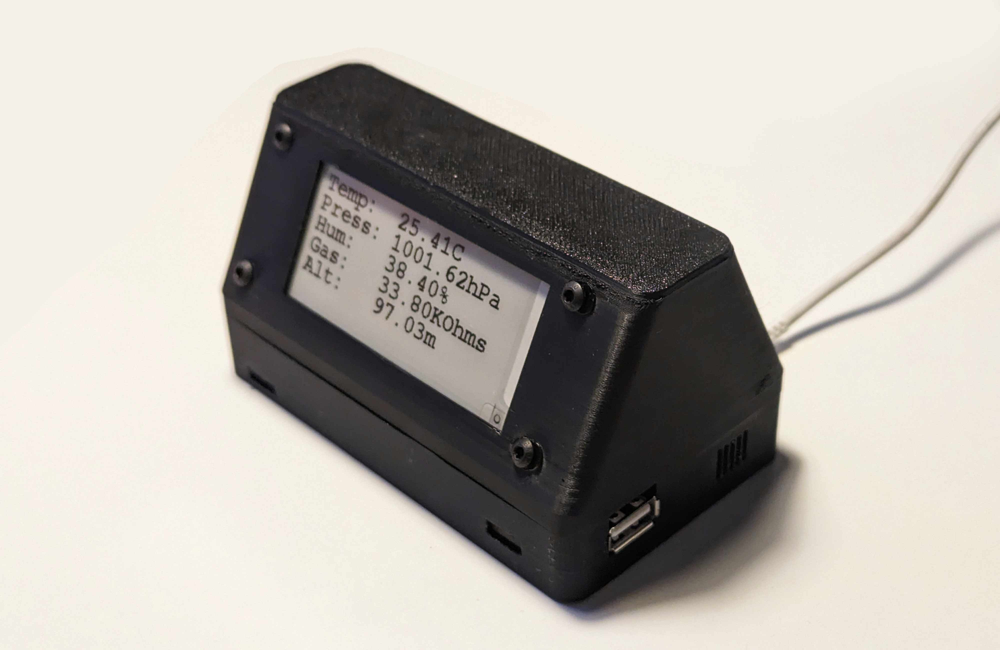
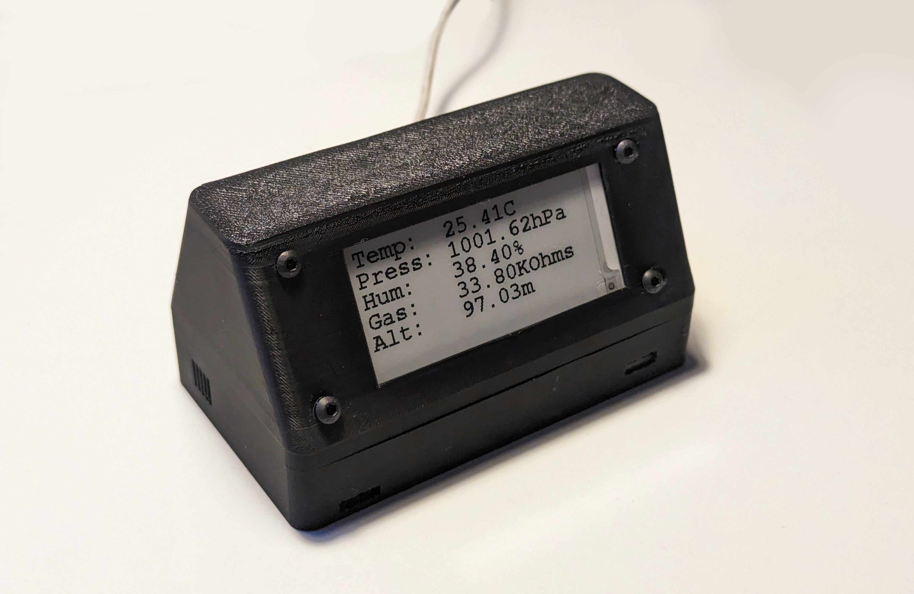
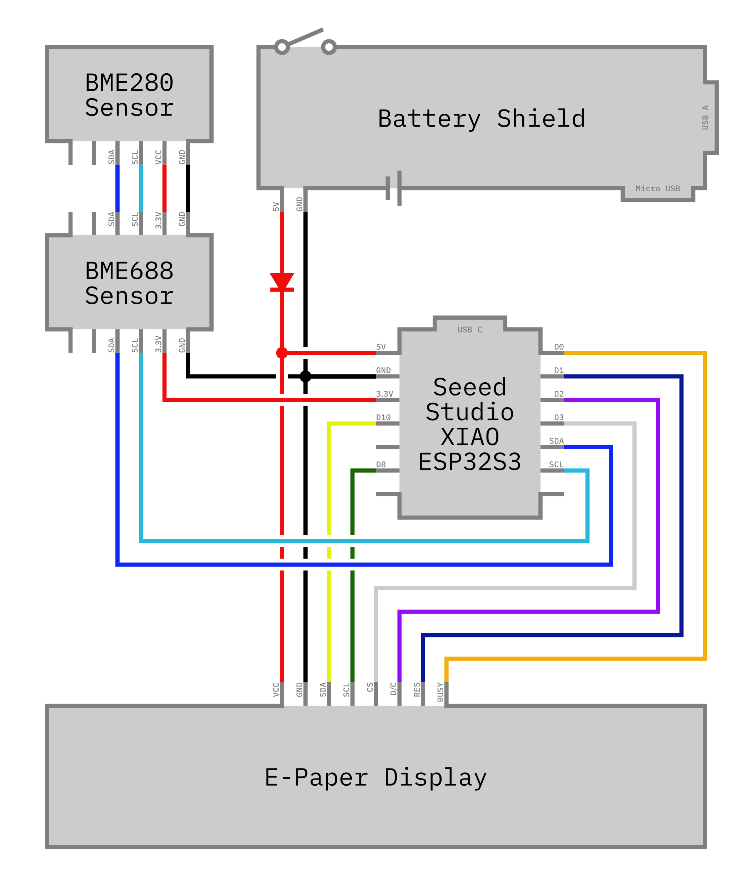

# Wetterstation mit Arduino

Dieses Arduino-Projekt implementiert eine Wetterstation, die die Sensoren BME680 und BME280 verwendet, um verschiedene Umweltparameter wie Temperatur, Luftfeuchtigkeit, Luftdruck und Gaswiderstand zu messen. Die gemessenen Daten werden auf einem E-Paper-Display angezeigt.

## Funktionen und Komponenten

### Verwendete Hardware

- **BME680 Sensor**: Ein Umweltsensor, der Temperatur, Luftfeuchtigkeit, Luftdruck und Gaswiderstand misst.
  - https://www.reichelt.de/entwicklerboards-sensor-bosch-bme688-debo-sens-bme688-p306628.html
- **BME280 Sensor**: Ein weiterer Umweltsensor, der Temperatur, Luftfeuchtigkeit und Luftdruck misst.
  - https://www.ebay.de/itm/116172095282
- **E-Paper-Display**: GxEPD2 Library zur Ansteuerung eines E-Paper-Displays mit SSD1680 Controller.
  - https://de.aliexpress.com/item/1005005183232092.html
- **Arduino Board**: Seeed Studio XIAO ESP32S3
  - https://www.seeedstudio.com/XIAO-ESP32S3-p-5627.html
- **Battery Shield**: Battery Shield für eine 18650 Battery
  - https://de.aliexpress.com/item/1005005986332436.html

### Verwendete Bibliotheken

- **Wire.h**: Standard Arduino Bibliothek für die I2C-Kommunikation.
- **Adafruit_Sensor.h**: Adafruit Sensor Bibliothek für die Sensoransteuerung.
- **Adafruit_BME680.h**: Adafruit Bibliothek für den BME680 Sensor.
- **Adafruit_BME280.h**: Adafruit Bibliothek für den BME280 Sensor.
- **GxEPD2_BW.h**: GxEPD2 Bibliothek für die Ansteuerung von E-Paper-Displays.
- **Adafruit_GFX.h**: Adafruit Grafikbibliothek für die Anzeige auf dem E-Paper-Display.
- **BME280I2C.h**: Bibliothek für die I2C-Kommunikation mit dem BME280 Sensor.
- **Fonts/FreeMonoBold9pt7b.h**: Schriftart für die Anzeige auf dem E-Paper-Display.

### Installation

1. **Arduino IDE**: Stelle sicher, dass die Arduino Integrated Development Environment (IDE) installiert ist.
2. **Bibliotheken**: Installiere die oben aufgeführten Bibliotheken in der Arduino IDE über den Bibliotheksmanager.

### Schaltungsaufbau

### 3D-Druck für Gehäuse

Das Gehäuse für die Wetterstation kann über folgenden Link heruntergeladen werden: [Link zur 3D-Druck Datei](3dmodel).

## Lizenz
Dieses Projekt ist unter der [Creative Commons Attribution-NonCommercial 4.0 International License](https://creativecommons.org/licenses/by-nc/4.0/) lizenziert. Das bedeutet, dass du das Material teilen und bearbeiten kannst, solange du es nicht für kommerzielle Zwecke nutzt und mich als Urheber angibst.

---
Autor: [Jakob](https://github.com/jakobhaid)
